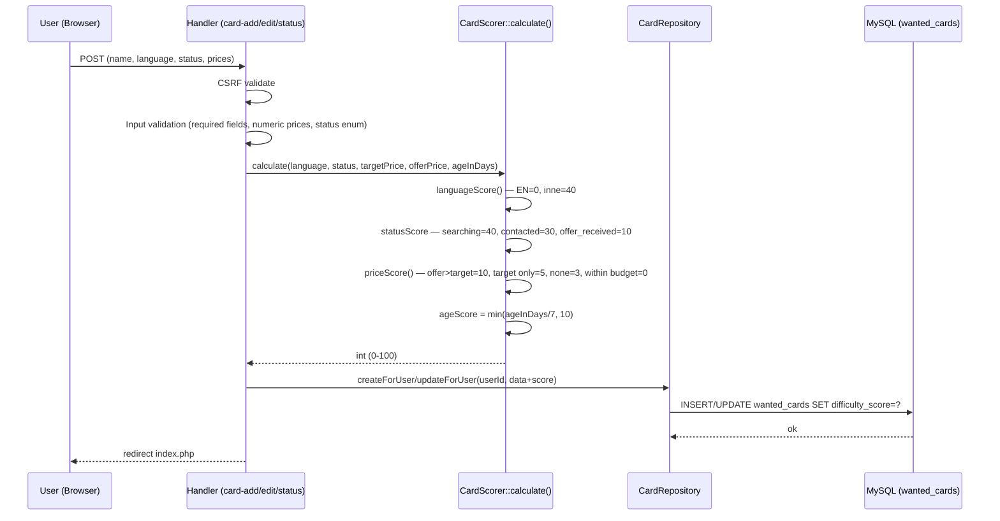

# Research: CardScorer — analiza przepływu i dług techniczny

**Cel:** Analiza przepływu obliczania i zapisu difficulty_score — od wejścia użytkownika do bazy danych.  
**Entry point:** `public/card-add.php` (tworzenie), `public/card-edit.php` (edycja), `public/card-status.php` (quick status change)  
**Dlaczego mapa wskazała ten obszar:** CardScorer oznaczony jako Core/High sensitivity — zmiana algorytmu dotyka 3 handlerów i wszystkich zapisanych kart.

---

## Feature overview

### Trace e2e — przepływ od formularza do bazy



### Krok po kroku (z file:line)

| Krok | Plik | Linia | Co się dzieje |
|---|---|---|---|
| 1. POST przyjęty | `card-add.php` | 34 | `$_SERVER['REQUEST_METHOD'] === 'POST'` |
| 2. CSRF check | `card-add.php` | 46–50 | `Csrf::validate($token)` |
| 3. Walidacja inputu | `card-add.php` | 51–65 | name/language required, status enum, prices numeric |
| 4. Konwersja cen | `card-add.php` | 68–72 | string → float lub null |
| 5. **Score obliczony** | `card-add.php` | 75–81 | `CardScorer::calculate(language, status, target, offer, 0)` |
| 6. Score zapisany | `card-add.php` | 83–93 | `$data['difficulty_score'] = $score` |
| 7. INSERT do DB | `CardRepository.php` | createForUser | PDO prepared statement |

**Kluczowa obserwacja:** w `card-add.php` age jest zawsze `0` (linia 81) — nowa karta nie ma historii. W `card-edit.php` age jest obliczany z `created_at`. W `card-status.php` age jest obliczany przez `time() - strtotime($card['created_at'])`.

### Warianty wywołania CardScorer::calculate()

| Handler | ageInDays | Skąd pochodzi |
|---|---|---|
| `card-add.php:75` | hardcoded `0` | Nowa karta, brak historii |
| `card-edit.php` | obliczony z `created_at` | DB → PHP datetime diff |
| `card-status.php:47` | `round((time()-strtotime(created_at))/86400)` | DB fetch → runtime |
| `index.php` | n/a | Używa `CardScorer::explain()` tylko do wyświetlenia, nie zapisuje |

---

## Technical debt

### TD-01 — Niespójne obliczanie age (MEDIUM risk)

**Evidence:** `card-add.php:81` używa `0`, `card-edit.php` oblicza z `created_at`, `card-status.php:47` używa `round()`.

**Problem:** `card-status.php` używa `round()` (zaokrągla 0.5 dnia do 1 dnia), a `card-edit.php` używa rzutowania int (obcina). Dla tej samej karty `card-edit` i `card-status` mogą dać różny score przy granicznym wieku.

**Inference:** Przy karcie mającej dokładnie 3.5 dnia — `card-edit` da ageInDays=3, `card-status` da ageInDays=4. Różnica 1 dnia rzadko przekracza próg tygodnia, ale jest to cicha niespójność.

**Caution:** Każda zmiana sposobu obliczania age musi być wprowadzona w 3 miejscach jednocześnie.

---

### TD-02 — Score nie jest przeliczany po upływie czasu (HIGH risk, domain)

**Evidence:** Score jest obliczany tylko przy save (add/edit/status). Karta stworzona 10 tygodni temu z score=40 (EN, searching, no prices) będzie dalej pokazywać 40, a nie 50 (40 + 10 za wiek).

**Problem:** `difficulty_score` w bazie jest stalą migawką z czasu zapisu, nie wartością dynamiczną.

**Inference:** Lista kart sortowana po `difficulty_score DESC` może dawać mylące priorytety — stare karty nie rosną w rankingu mimo upływu czasu.

**Caution przed zmianą:** Dodanie przeliczania przy każdym wyświetleniu (`index.php`) wymagałoby zmiany architektury (score obliczany w locie, nie z DB) lub cron joba do masowego update'u.

**Unknown:** Czy takie zachowanie jest świadome (performance) czy przeoczone?

---

### TD-03 — Brak walidacji zakresu score w bazie (LOW risk)

**Evidence:** `database/schema.sql` — `difficulty_score INT UNSIGNED NOT NULL DEFAULT 0`. Brak CHECK constraint `<= 100`.

**Problem:** Algorytm gwarantuje max 100, ale baza tego nie wymusza. Ręczny INSERT lub błąd w przyszłym algorytmie mógłby zapisać 150.

**Inference:** Ryzyko niskie, bo PHP strict types + statyczna logika. Ale naruszenie kontraktu byłoby ciche.

---

### TD-04 — Logika priceScore() ma "martwy" case (LOW risk)

**Evidence:** `CardScorer.php:95-109` — `priceScore()` zwraca 0 gdy `offer <= target` (linia 99: `return $currentOfferPrice > $targetPrice ? 10 : 0`).

**Problem:** Gdy offer=8 i target=10 (oferta mieści się w budżecie), score za cenę = 0. Ale to właśnie dobra sytuacja — karta jest osiągalna! Algorytm nagradza brakiem punktów (=mniejszy priorytet) cards które mają ofertę w budżecie, co jest semantycznie poprawne, ale kontrast z "no pricing data = 3" jest nieoczywisty (brak danych = wyższy score niż dobra oferta).

**Inference:** Możliwy błąd domenowy — karta z dobrą ofertą (offer < target) dostaje 0 pkt za cenę, karta bez cen dostaje 3 pkt. Karta bez cen ma wyższy priorytet niż karta z ceną w budżecie.

---

### Blast radius — co zmienia się razem

| Zmiana | Dotknięte pliki | Typ sprzężenia |
|---|---|---|
| Algorytm punktacji (wagi) | `CardScorer.php`, `CardScorerTest.php`, `docs/business-rules.md` | Kontrakt + testy |
| Nowy komponent score | `CardScorer.php`, `card-add.php`, `card-edit.php`, `card-status.php`, `index.php` (explain), testy | 5 plików |
| Nowy status ENUM | `database/schema.sql`, `CardScorer.php`, `card-add.php`, `card-edit.php`, `card-status.php`, `index.php` (formatStatus), `CardScorerTest.php` | 7 plików |
| Zmiana nazwy kolumny `difficulty_score` | `CardRepository.php`, `index.php`, `schema.sql` | 3 pliki |

---

### Weryfikacja twierdzeń strukturalnych (grep)

**Twierdzenie:** "CardScorer::calculate wywołany w 3 handlerach"

```bash
grep -rn "CardScorer::calculate" public/ src/ --include="*.php"
# Wynik:
# public/card-add.php:75
# public/card-edit.php:75
# public/card-status.php:49
# Potwierdzone: 3 call-sity
```

**Twierdzenie:** "CardScorer::explain używany tylko w index.php"

```bash
grep -rn "CardScorer::explain" public/ src/ --include="*.php"
# Wynik:
# public/index.php:88
# Potwierdzone: 1 call-site
```

**Twierdzenie:** "status enum VALID_STATUSES zdefiniowany w 2 plikach"

```bash
grep -rn "VALID_STATUSES\|acquired.*abandoned\|searching.*contacted" public/ --include="*.php"
# Wynik: card-add.php:19, card-edit.php:35, card-status.php:31
# Doprecyzowane: 3 miejsca definiują allowed statuses (2 jako stała VALID_STATUSES, 1 jako $allowed)
```

**Uwaga:** Brak `ast-grep` w środowisku Windows XAMPP — weryfikacja wykonana przez klasyczny grep. Wyniki deterministyczne dla PHP bez aliasów.

---

### Luki w testach

| Ścieżka | Status testu |
|---|---|
| `CardScorer::calculate` — terminal statuses | ✅ Pokryte (Group 1) |
| `CardScorer::calculate` — language rarity | ✅ Pokryte (Group 3) |
| `CardScorer::calculate` — status ordering | ✅ Pokryte (Group 4) |
| `CardScorer::calculate` — score ceiling | ✅ Pokryte (Group 5) |
| `CardScorer::explain` — terminal | ✅ Pokryte (Group 6) |
| **priceScore: offer < target = 0** | ❌ Brak testu |
| **priceScore: offer == target = 0** | ❌ Brak testu |
| **Niespójność round() vs int cast w age** | ❌ Brak testu |
| **card-add.php: age=0 hardcode** | ❌ Brak testu integracyjnego |
| **card-status.php: score recalc przy zmianie statusu** | ❌ Brak testu |

---

### Ograniczenia tej analizy

- Analiza statyczna — nie obejmuje zachowania runtime przy błędach DB
- Brak testów integracyjnych — nie weryfikujemy czy score faktycznie trafia do bazy poprawnie
- TD-02 (stale score) wymaga decyzji domenowej przed jakąkolwiek zmianą
