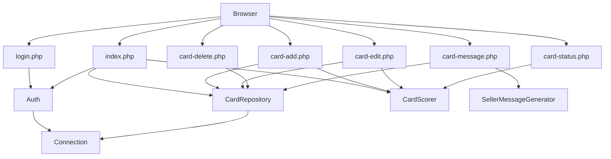

# Repo Map — AI Card Collector

Generated: 2026-06-28 | Method: git history + static PHP dependency analysis

## TL;DR

Jednoplikowa aplikacja PHP 8 do śledzenia poszukiwań kart kolekcjonerskich. Architektura flat MVC bez frameworka: 8 entry pointów w `public/`, 6 klas w `src/`. Główna wartość biznesowa koncentruje się w CardScorer (algorytm trudności) i CardRepository (CRUD). Auth i CSRF są cross-cutting — obecne w każdym requeście. Brak cykli, warstwy respektowane, projekt jednosobowy.

## Teren

| Moduł | Rola | Głębokość | Profil zmian | Wrażliwość |
|---|---|---|---|---|
| `src/Auth/Auth.php` | Core — bramka każdego requestu | shallow (4 metody statyczne) | stable | **high** — błąd = brak dostępu |
| `src/Card/CardScorer.php` | Core — logika biznesowa | deep (4 komponenty, algorytm) | volatile (reguły domenowe) | **high** — zmiana = rekalkukacja kart |
| `src/Card/CardRepository.php` | Supporting — data access | deep (CRUD + ownership checks) | stable | medium |
| `src/Security/Csrf.php` | Supporting — cross-cutting | shallow (2 metody) | stable | medium — obecny w każdym POST |
| `src/Database/Connection.php` | Supporting — infrastruktura | shallow (singleton) | stable | high — awaria = brak DB |
| `src/Message/SellerMessageGenerator.php` | Supporting — szablony | shallow (2 locale) | volatile (treść komunikatów) | low |
| `public/index.php` | Core — główny widok | deep (stats + filter + table) | volatile (UI ewoluuje) | medium |
| `public/card-*.php` | Core — CRUD handlers | medium | stable | medium |

## Realne powiązania

**Load-bearing (wysokie incoming coupling):**
- `Auth\Auth` — Ca=8, każda strona public/ zależy od Auth
- `Security\Csrf` — Ca=7, każdy formularz POST zależy od Csrf
- `Database\Connection` — Ca=7, każda operacja DB przechodzi przez singleton

**Co zmienia się razem:**
- `card-add.php` + `card-edit.php` — wspólna logika formularzy i scoringu
- `CardScorer.php` + `card-add.php` + `card-edit.php` + `card-status.php` — zmiana algorytmu dotyka 3 handlery
- `database/schema.sql` + `CardRepository.php` — zmiany schematu wymagają synchronizacji z repo

**Brak cykli** — weryfikacja przez grep na `use App\`: żadna klasa src/ nie importuje innej klasy src/.

## Strefy ryzyka

1. **Auth\Auth** — używany przez 8 plików; błąd lub zmiana sygnatury `requireAuth()` / `user()` łamie całą aplikację
2. **CardScorer algorithm** — reguły punktacji (np. 40 pkt za nieangielski język) są decyzjami domenowymi; zmiana bez zrozumienia kontekstu kolekcjonerskiego daje mylące priorytety
3. **Database\Connection singleton** — brak konfiguracji DB = biały ekran wszędzie; `.env` nie jest commitowany, co wymaga ręcznej konfiguracji przy każdym deploy
4. **Session / CSRF coupling** — `Auth::startSession()` musi być wywołany przed Csrf i przed jakimkolwiek output HTML; błędna kolejność = headers already sent
5. **schema.sql ↔ CardRepository** — `updateForUser()` aktualizuje 9 konkretnych kolumn; dodanie nowej kolumny do schematu wymaga synchronizacji z PHP

## Kogo zapytać

| Strefa | Kontakt | Dlaczego |
|---|---|---|
| Wszystkie | Sebastian Zylkowski | Jedyny deweloper, właściciel domenowy |
| Logika scoringu | Sebastian | Rozumie co czyni kartę "trudną" (rynek wtórny, language rarity) |
| Seller templates EN/PT | Sebastian | Kontekst geograficzny i komunikacyjny |
| Status workflow | Sebastian | Wie jak przebiega realne poszukiwanie karty |

## Pierwszy dzień — od czego zacząć

1. `database/schema.sql` — zrozum model danych (users + wanted_cards)
2. `src/Auth/Auth.php` — bramka każdego requestu
3. `src/Card/CardScorer.php` — główna logika biznesowa i jej algorytm
4. `public/index.php` — główny widok, widać całą architekturę w jednym miejscu
5. `src/Card/CardRepository.php` — jak dane trafiają do/z DB
6. `docs/business-rules.md` — reguły domenowe w języku naturalnym
7. `context/foundation/prd.md` — cele i zakres MVP

## Ograniczenia tej mapy

- **Okno czasowe**: projekt ma 4 dni — historia git nie dostarcza wzorców aktywności
- **Graf statyczny**: nie pokazuje zależności przez `$_SESSION`, `config/app.php` (require, nie use), ani konfigurację runtime
- **Narzędzie**: ręczna analiza grep zamiast dependency-cruiser (projekt PHP bez node_modules)
- **Czego mapa NIE mówi**: jakości kodu, pokrycia testami, wydajności zapytań SQL, zachowania przy błędach
